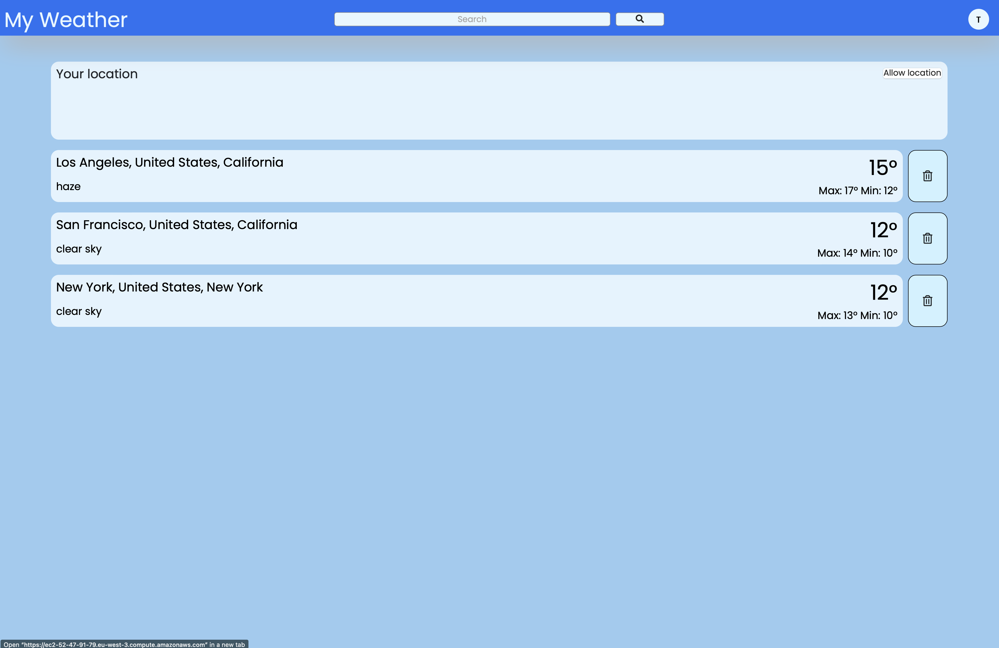

# Django Weather Web Application

This is a Weather web application created with Django Web Framework. \
Deployed version on AWS [here](https://ec2-52-47-91-79.eu-west-3.compute.amazonaws.com)

## Features:

* Creating accounts
* Detailed view of city forecast
* Hourly forecast
* Weekly forecast
* Other info regarding wind, pressure and other
* Adding cities to dashboard
* Current weather based on location
* Changing of units

## Technologies:

Project created with:
* Openweather API
* Django
* PostgreSQL
* Docker
* Bootstrap
* 3rd party ssl certificate

